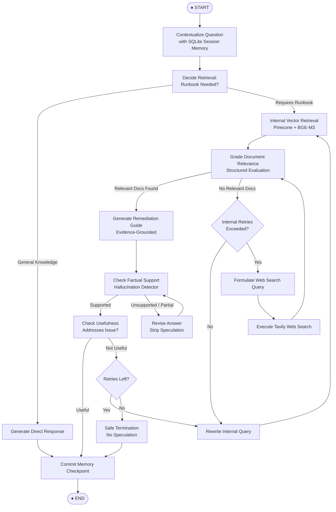

# 🛡️ CloudOps Sentinel Copilot
### *Enterprise Self-RAG Incident Response & Cloud Operations AI System*

[](https://www.python.org/)
[](https://fastapi.tiangolo.com/)
[](https://github.com/langchain-ai/langgraph)
[](https://www.pinecone.io/)
[](https://build.nvidia.com/)
[](LICENSE)

---

## 📌 Executive Overview

**CloudOps Sentinel Copilot** is an industry-grade, agentic site reliability engineering (SRE) and cloud operations copilot built on a **Self-Reflective Retrieval-Augmented Generation (Self-RAG)** architecture. 

During high-severity cloud incidents (Sev-1 / Sev-2), traditional RAG solutions frequently fail due to:
- **Hallucinated remediation commands** that exacerbate outages.
- **Irrelevant document retrieval** cluttering context windows with outdated SOPs.
- **Context drift** across multi-turn diagnostic sessions.
- **Lack of fallback verification** when internal runbooks do not cover novel zero-day errors.

CloudOps Sentinel solves this by implementing an autonomous, self-evaluating state graph in **LangGraph**. It autonomously validates document relevance, self-grades factual support, refines retrieval queries when initial results are insufficient, falls back to targeted web searches when internal documentation is lacking, and logs an immutable audit trail for postmortem analysis.

---

## ⚡ Key Capabilities

- **Adaptive Self-RAG Orchestration**: Executes dynamic decision boundaries (`Retrieve` vs. `Direct Answer`), relevance evaluation, hallucination detection, and usefulness grading.
- **Self-Correction & Query Rewriting**: Iteratively reformulates internal vector search queries and external web queries up to configurable threshold limits.
- **Grounded Citation & Anti-Hallucination Guardrails**: Cross-examines generated responses against retrieved context blocks to ensure 100% evidentiary grounding before outputting remediation steps.
- **Dual-Tier Retrieval Pipeline**:
  - **Primary**: Internal Runbooks, SOPs, and Postmortems indexed into Pinecone via 1024-dimensional dense semantic vectors (`BAAI/bge-m3`).
  - **Fallback**: Real-time live web search via Tavily API for newly released CVEs, vendor status pages, and upstream cloud provider incidents.
- **Multi-Turn Incident Checkpointing**: Thread-isolated conversation memory persisted via SQLite checkpointers (`SqliteSaver`), enabling contextual query rewriting during ongoing triage.
- **Idempotent Ingestion Engine**: Automated document parsing (`PDF`, `DOCX`, `Markdown`, `TXT`) with SHA-256 chunk deduplication to prevent vector index pollution.
- **Enterprise Operations Console**: Dark-mode glassmorphic user interface equipped with live execution telemetry, node-by-node audit inspection, and instant runbook ingestion.

---

## 🔄 Self-RAG Graph Architecture

The core decision loop is governed by a **LangGraph** finite state machine:



---

## 📂 Repository Structure

```plaintext
CloudOps-Sentinel-Copilot/
├── app.py                     # FastAPI server, REST endpoints, and UI routes
├── data_ingestion.py          # Standalone batch ingestion runner
├── template.py                # Project scaffolding automation script
├── requirements.txt           # Python production dependencies
├── Dockerfile                 # Container packaging specification
├── .env.example               # Environment variables configuration template
│
├── src/                       # Core application logic
│   ├── __init__.py
│   ├── config.py              # Pydantic Settings & environment schema
│   ├── db.py                  # SQLite schema & audit trail management
│   ├── ingestion.py           # Document parsers, chunking & SHA-256 hash IDs
│   ├── models.py              # Pydantic schemas for requests/responses
│   ├── self_rag.py            # LangGraph StateGraph, self-reflection nodes & edges
│   └── vectorstore.py         # Pinecone client & BGE-M3 embedding factory
│
├── static/                    # Frontend assets
│   ├── app.js                 # UI controller, event loops, and API interaction
│   └── styles.css             # Enterprise glassmorphic dark-mode CSS
│
├── templates/                 # Jinja2 UI templates
│   └── index.html             # Operations control center view
│
├── documents/                 # Local directory for runbook source files
├── data/                      # Persistent SQLite storage (memory & audit logs)
└── uploads/                   # Runtime file upload staging directory
```

---

## 🛠️ Technology Stack

| Component | Technology | Description |
|---|---|---|
| **API Framework** | [FastAPI](https://fastapi.tiangolo.com/) + [Uvicorn](https://www.uvicorn.org/) | Asynchronous high-throughput REST API with OpenAPI documentation |
| **Agentic Workflow** | [LangGraph](https://github.com/langchain-ai/langgraph) | Cyclic graph state machine for self-reflective RAG logic |
| **LLM Inference** | [Meta LLaMA 3.3 70B Instruct](https://build.nvidia.com/) | Enterprise reasoning hosted via NVIDIA NIM (or OpenAI compatible) |
| **Embeddings** | [BAAI/bge-m3](https://huggingface.co/BAAI/bge-m3) (1024-dim) | High-performance multi-lingual embedding via HuggingFace or NVIDIA |
| **Vector Database** | [Pinecone Serverless](https://www.pinecone.io/) | Managed vector database with cosine similarity and namespace isolation |
| **Web Search** | [Tavily AI](https://tavily.com/) | Real-time web search engine optimized for LLM reasoning |
| **State & Checkpoints** | [SQLite](https://www.sqlite.org/) | Local persistent storage for multi-turn sessions and audit records |
| **Document Loaders** | `PyPDF`, `python-docx`, `TextLoader` | Native support for multi-format operational manuals and runbooks |

---

## 🚀 Quickstart Guide

### 1. Prerequisites

- **Python 3.10** or higher
- **Pinecone Account** & API Key
- **NVIDIA Developer Key** (or OpenAI API Key)
- **Tavily Search API Key**

### 2. Clone and Setup Environment

```bash
# Clone repository
git clone https://github.com/soumyadipjccn/CloudOps-Sentinel-Copilot.git
cd CloudOps-Sentinel-Copilot

# Create virtual environment
python3 -m venv venv
source venv/bin/activate

# Install dependencies
pip install --upgrade pip
pip install -r requirements.txt
```

### 3. Configure Environment Variables

Create your `.env` configuration from the provided template:

```bash
cp .env.example .env
```

Update `.env` with your API credentials:

```dotenv
# LLM (NVIDIA NIM API / OpenAI-compatible)
NVIDIA_API_KEY=nvapi-your-key-here
LLM_BASE_URL=https://integrate.api.nvidia.com/v1
LLM_MODEL=meta/llama-3.3-70b-instruct

# Embeddings (BAAI/bge-m3 default dimension is 1024)
EMBEDDING_PROVIDER=huggingface
EMBEDDING_MODEL=BAAI/bge-m3
EMBEDDING_DIMENSION=1024

# Pinecone Vector Store
PINECONE_API_KEY=pcsk_your-pinecone-key
PINECONE_INDEX_NAME=cloudops-sentinel-bge-m3
PINECONE_NAMESPACE=incident-runbooks
PINECONE_CLOUD=aws
PINECONE_REGION=us-east-1

# External Web Search
TAVILY_API_KEY=tvly-your-key-here

# Self-RAG Threshold Controls
TOP_K=5
MAX_SUPPORT_RETRIES=2
MAX_RETRIEVAL_REWRITES=2
MAX_WEB_REWRITES=2
DATABASE_PATH=data/audit.db
```

### 4. Launch Application

```bash
uvicorn app.py:app --host 0.0.0.0 --port 8000 --reload
```

Access the Operations Console at:
👉 **`http://localhost:8000`**

Interactive OpenAPI Documentation:
👉 **`http://localhost:8000/docs`**

---

## 📚 Runbook Ingestion

### Option A: Web UI Drag-and-Drop
1. Navigate to the **Knowledge Base Ingestion** panel in the left sidebar.
2. Drag and drop any `.pdf`, `.docx`, `.md`, or `.txt` file into the upload zone.
3. The server automatically validates schema, computes SHA-256 chunk IDs, builds dense embeddings, and inserts them into Pinecone under the active namespace.

### Option B: Python Ingestion Pipeline
To ingest runbooks programmatically or batch ingest entire folders:

```python
from pathlib import Path
from src.ingestion import ingest_file, ingest_directory

# Ingest single runbook
chunks = ingest_file(Path("documents/k8s_incident_runbook.pdf"))
print(f"Indexed {chunks} chunks.")

# Batch ingest directory
total_chunks = ingest_directory(Path("documents/"))
print(f"Total indexed chunks: {total_chunks}")
```

---

## 🔌 API Reference

### `POST /api/chat`
Execute a contextual, Self-RAG guided query against cloud runbooks.

**Request Payload:**
```json
{
  "question": "Kubernetes pods in production-payments are CrashLoopBackOff with OOMKilled status. What are the triage steps?",
  "thread_id": "incident-sev1-pod-crash-2026"
}
```

**Response Payload:**
```json
{
  "answer": "1. Inspect pod memory usage: `kubectl top pod <pod-name> -n production-payments`.\n2. Review container memory limits in deployment spec.\n3. Identify recent traffic anomalies or memory leaks via Prometheus.",
  "route": "Private Runbooks",
  "used_web_search": false,
  "support_status": "fully_supported",
  "usefulness": "useful",
  "sources": [
    {
      "type": "internal",
      "title": "k8s_troubleshooting_sop.md",
      "source": "/app/uploads/k8s_troubleshooting_sop.md",
      "url": null,
      "page": null
    }
  ],
  "trace": [
    "Memory: new incident session",
    "Retrieval decision: True",
    "Internal retrieval: 5 chunks",
    "Relevance grade (internal): 3/5 relevant",
    "Generated answer from internal evidence",
    "Support check: fully_supported",
    "Usefulness check: useful",
    "SQLite memory checkpoint updated"
  ],
  "thread_id": "incident-sev1-pod-crash-2026",
  "memory_turns": 1
}
```

---

### `POST /api/upload`
Upload and index an operational runbook document.

- **Content-Type**: `multipart/form-data`
- **Supported Extensions**: `.pdf`, `.docx`, `.md`, `.txt`

**Response Payload:**
```json
{
  "filename": "database_failover_sop.pdf",
  "chunks_indexed": 14,
  "namespace": "incident-runbooks"
}
```

---

### `GET /api/audit`
Retrieve the immutable verification audit log for SRE postmortem reviews.

**Query Parameters:**
- `limit` (int, default: 25): Maximum records to fetch.

**Response Payload:**
```json
[
  {
    "id": 12,
    "created_at": "2026-09-14T12:45:00.123456+00:00",
    "question": "How to rotate AWS KMS keys?",
    "answer": "Follow SOP-SEC-09...",
    "route": "Private Runbooks",
    "used_web": 0,
    "support_status": "fully_supported",
    "usefulness": "useful",
    "trace_json": "[...]",
    "sources_json": "[...]"
  }
]
```

---

### `GET /api/health`
Health check endpoint for container liveness and readiness probes.

```json
{
  "status": "healthy",
  "service": "CloudOps Sentinel Copilot"
}
```

---

## 🔒 Security & Safe Operations Guardrails

- **Zero Hallucination Tolerance**: If evidence is missing, contradictory, or insufficient, the system gracefully terminates with:
  > *"I could not find enough reliable runbook or external evidence to recommend a safe troubleshooting action."*
- **Strict Evidence Boundary**: The generator model is instruction-tuned to prioritize internal postmortems and SOPs. If external web results are utilized, the system explicitly tags them as external guidance to avoid confusing them with company-specific internal architecture.
- **Thread Isolation**: Incident threads are partitioned by `thread_id` within the LangGraph SQLite checkpoint database to eliminate cross-session data leakage.
- **Idempotency Safeguards**: Chunks are fingerprinted using SHA-256 digests (`{stem}-{index}-{hash}`); re-uploading documents updates existing vectors rather than duplicating tokens.

---

## 🐳 Containerization & Deployment

To run CloudOps Sentinel in containerized cloud infrastructure (Kubernetes, AWS ECS, GCP Cloud Run):

### Build & Run Docker Container

```bash
# Build image
docker build -t cloudops-sentinel-copilot:1.0.0 .

# Run container
docker run -d \
  --name cloudops-sentinel \
  -p 8000:8000 \
  --env-file .env \
  -v $(pwd)/data:/app/data \
  cloudops-sentinel-copilot:1.0.0
```

---

## 🤝 Contributing

Contributions to CloudOps Sentinel Copilot are welcome! Please adhere to the following workflow:

1. Fork the repository.
2. Create a feature branch (`git checkout -b feature/adaptive-reranker`).
3. Commit changes (`git commit -m 'feat: add cross-encoder reranking step'`).
4. Push to branch (`git push origin feature/adaptive-reranker`).
5. Open a Pull Request with complete test coverage details.

---

## 📄 License

This project is licensed under the Apache 2.0 License - see the [LICENSE](LICENSE) file for details.
